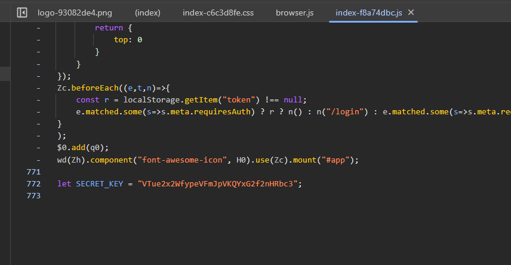

 # Imperium

## Description
 You encountered a blogging website. Your goal is to find a key hidden in a user's password. 

## Writeup
In this challenge, you're supposed to find a user's password.
Identifying which user specifically is pretty trivial:

By checking the dev tools, you can find the user's ID:

By checking the headers of the same request, you can find the server URL.

By using a cURL tool like Postman, we can query the server for the user's ID, and we receive a JSON response containing the user's encrypted password.

We can notice the password ends with `==`, which is common for base64 passwords.
we can decrypt the password by using a base64 decryption function like `atob()` in javascript.

Hmm, we still get an encrypted password in return. Meaning that there's another layer of encryption.

If we were to inspect the assets of the homepage of the application, we'll find a variable containing a `SECRET_KEY`, maybe we can use that alongside the our de-base64-ied string to find 
the real password.

Let's use a XOR function.

And finally there's our flag `N7-CTF{17'5_d4n63r0u5_70_90_4l0n3!_74k3_7h15_c47_w17h_y0u}` .
