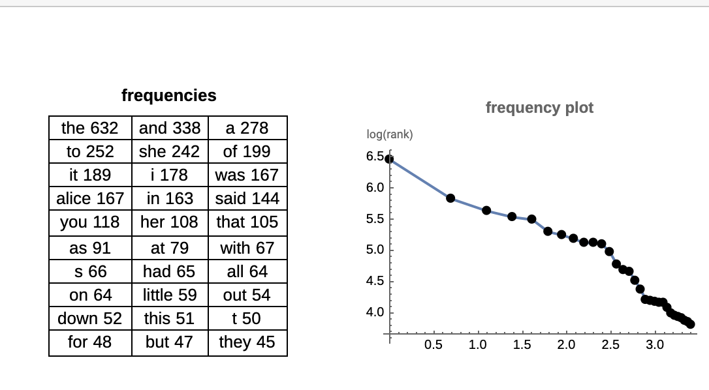
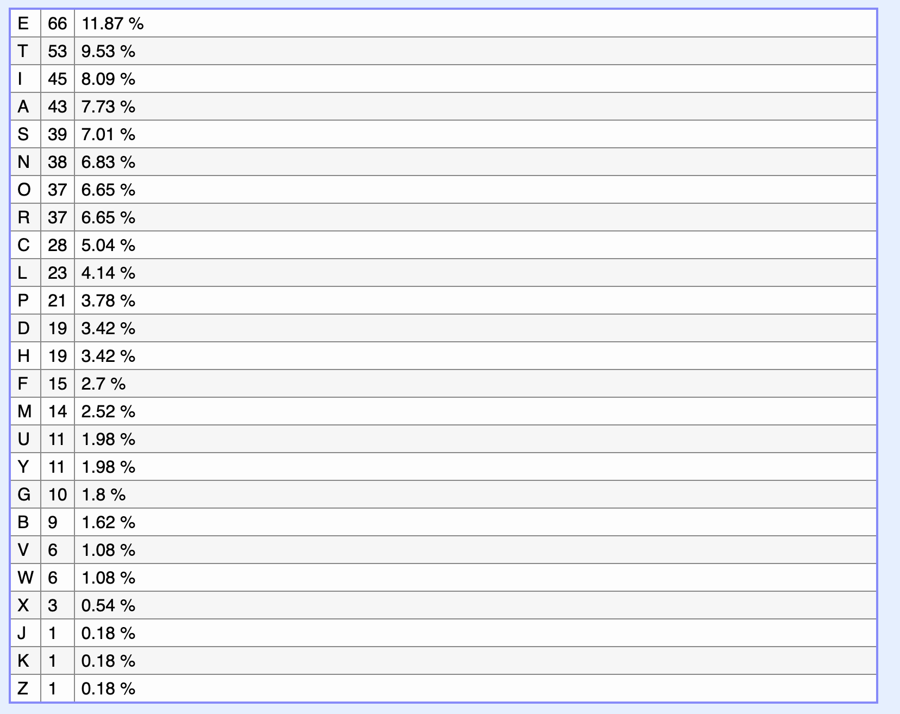

desc: ever heard of zipf's law? it's kinda similar to that.

the description refers to the zipf's theory.

zipf's law can be applied to words, it takes into consideration the frequency each word was mentioned in a given text. as this example shows:

in our case the paragraph is much smaller, therefore (it's kinda similar in the description..), we will be applying it to characters instead. 

then group them by order : ETIASNORCLPDHFMUYGBVWXJKZ

add the flag format: 
```
N7-CTF{ETIASNORCLPDHFMUYGBVWXJKZ}
```


## Author

- [@Yvesei](https://github.com/Yvesei)
